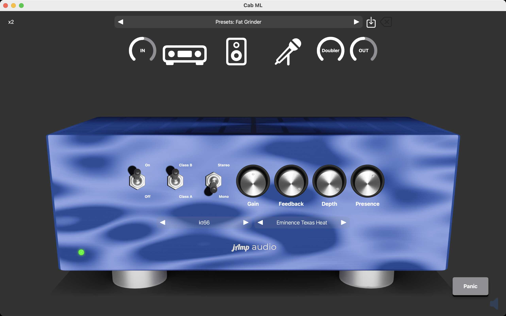
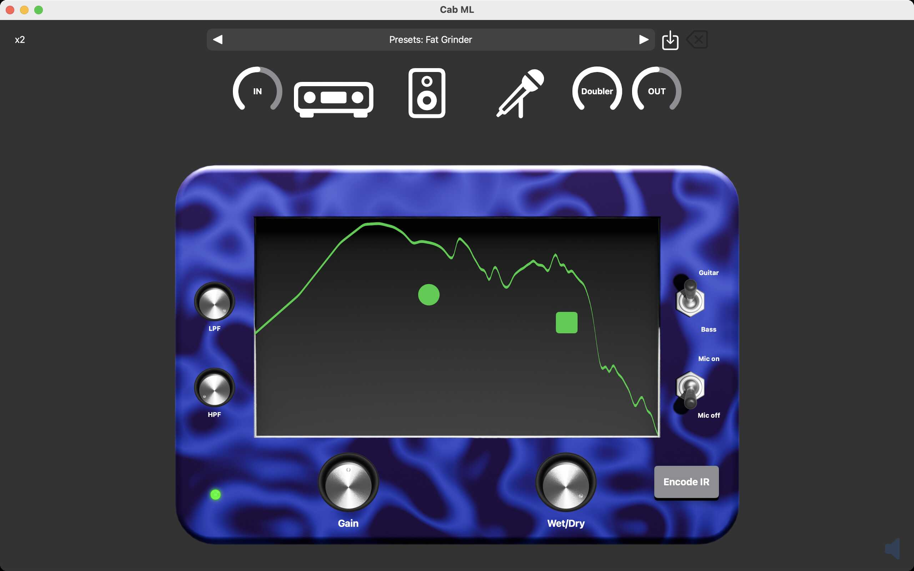
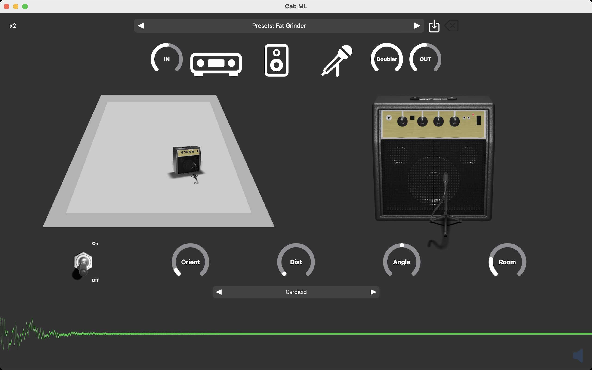

# jAmp Cab ML (AUv3) manual

Welcome to the [jAmp Cab ML](https://www.jamp-audio.com/cabml.html) manual!

## System requirements

Cab ML is an AUv3 (Audio Unit version 3) plugin that can be used as a stand-alone application on iOS and macOS, or as an audio plugin inside a host application on iOS and macOS. 

Minimal requirements are:
  - iOS 14.0 or later for mobile (iPhone or iPad)
  - macOS 11.0 or later for desktop / laptop

The Cab ML software is distributed via the Apple App store. Click on the App store badge to go to the download location.

## Purchase info

Installation of Cab ML is free, but it will run in DEMO mode. This means that every minute Cab ML will output 3 seconds of silence. This allows the user to test the audio plugin in depth before purchasing it.

Purchasing Cab ML is a straightforward and user-friendly process, following the standard steps from the Apple App Store you're likely familiar with. Once the plugin is unlocked, the DEMO mode will be gone, and you can enjoy the full potential.

To start the payment process you have to run Cab ML in stand-alone mode. A popup as in the image above should appear. Simply tap or click on "Purchase" and the Apple App Store will guide you through the process.

Note that you should only pay once to unlock the plugin. In case you have a new device, you can get the plugin unlocked by clicking on "Restore". If you go a second time through the payment system, no worries, Apple will notice this and give you the plugin for free.

Note that it is not possible to purchase the audio plugin via a third-party host application. If you run Cab ML via for instance GarageBand you will get a message as in the image above. Just start the stand-alone Cab ML application if you want to purchase.

## Navigation bar

The navigation bar at the top of your view consists of two rows. The top row controls the oversampling rate and the preset section. The second row represents the signal chain flow. We can navigate via icons to the different sections (poweramp, cabinet, microphone), and we can control the input and output level and the doubler effect.

### Top row

At the top left you can control the amount of oversampling. Generally, the more oversampling that is used, the better the simulation will be. The default oversampling rate is x2 as this gives good sound quality and is still easy on the CPU. If you go to a lower oversampling rate (x1), the plugin will be less demanding for your CPU but the sound quality is less. 

In the middle we have the preset section. There are a bunch of factory settings that you can experiment with. Furthermore, you can also save your own user settings. The icon with the arrow pointing downward will allow you to save your preset. A popup will show up asking you for the name of your user preset. If the suggested name is colored red, it means that you will overwrite an already existing user preset. You can also delete a user preset by tapping or clicking on the icon with the X mark. Note that you cannot delete factory settings.

### Signal chain row

 Control the signal input

 Go to the poweramp section

 Go to the cabinet section

 Go to the microphone section

 Add stereo effect by delaying the right channel wrt the left channel (disabled when poweramp is in stereo mode)

 Control the signal output

### Mute button
If you run Cab ML in it's stand-alone format, you will have an icon of a speaker on the bottom right. This is your muting button. By default, at startup, the sound will be muted to avoid any unwanted feedback. Don't forget to unmute before you start playing.

## Poweramp section

### On / Off

Turn the poweramp on or off.

### Class B / Class A

Choose between a Class B (push/pull) poweramp or Class A poweramp.

### Stereo / Mono

Treat the input signal as stereo or as mono. If stereo is selected, the Doubler control will have no effect.

### Gain

Controls the overall volume of the poweramp.

### Feedback

Controls the amount of feedback. When feedback is allowed, a portion of the poweramp output signal is fed again into the input loop.

### Depth

If feedback is enabled, the portion of the poweramp output signal that is fed into the input will first pass through a low pass filter. The strength of the low pass filter is managed by this control.

### Presence

If feedback is enabled, the portion of the poweramp output signal that is fed into the input will first pass through a high pass filter. The strength of the high pass filter is managed by this control.

### Tube selector

Several tubes (kt88, 6L6, EL34, kt66, ecc88, 12au7, 6550) can be used in the poweramp.

### Speaker selector

Several speaker simulations (Celestion V30, Celestion G12M-65 Creamback, Celestion F12M-X200, Electro Voice EVM12L, Eminence Legend 121A, Eminence Swamp Thang, Eminence Texas Heat, Jensen P6V, Jensen P8R, Jensen P10R, Jensen 10 Electric Lighting, Celestion Pulse 15, Eminence Delta 10A, Eminence Legend BP 122, Eminence Legend BP 1525, Jensen Punch BP 12) can be used in the poweramp.

### Panic button

Occasionally the feedback loop can really catch on and create an unwanted explosion of sound. In that case the poweramp will stop working. The panic button resets the poweramp. All settings remain as before, only the feedback control will be turned to 0.

## Cabinet section

### Interactive screen

This is the heart of the Cab ML plugin. By moving the circular or square marks you can change the impulse response in an interactive way. Underlying a neural network will generate an impulse response based on the position of the marks. Instead of trying out all your impulse response files through a classic impulse response loader, you can now find the right sound interactively by moving the marks until you like what you hear.

### LPF

A low pass filter that can be applied to the impulse response generated by the neural network. The default frequency is 22kHz, which means the LPF is actually turned off. Move the frequency to a lower value and the low pass filter will be activated.

### HPF

A high pass filter that can be applied to the impulse response generated by the neural network. The default frequency is 10Hz, which means the HPF is actually turned off. Move the frequency to a higher value and the high pass filter will be activated.

### Guitar / Bass

Cab ML contains two different neural networks for generating impulse responses. The first neural network will generate impulse responses for guitars, and the second will generate impulse response for bass guitars.

### Mic on / Mic off

Turn on or off the effect of the microphone section.

### Gain

A volume control for the impulse response.

### Wet/Dry

The amount of impulse response you want to mix with your input signal.

### Encode IR button

This button will open a file browser. In the file browser you can load any impulse response you have. Cab ML will automatically determine the mark positions so that the neural network will generate an impulse response that is as close as possible to the impulse response that you selected via the file browser.

## Microphone section

### Interactive room positioning

Positioning control for your amplifier in the room.

### Interactive mic positioning

Positioning control for your microphone with respect to your amp.

### On / Off

Turn on or off the microphone section.

### Orient

Rotate your amp in the room.

### Dist

The distance of your microphone to your amp.

### Angle

The angle of your microphone with respect to your amp.

### Room

The size of the room (small to large).

### Microphone type selector

Select your microhpone type (Bidirectional, Hypercardioid, Cardioid, Subcardioid, Omnidirectional).

## Connect your audio interface to iPad/iPhone

You need an audio interface to connect your instrument to your mobile device. Known audio interface brands are for instance [Focusrite](https://focusrite.com) or [IK Multimedia](https://www.ikmultimedia.com/).

For iPad you might want to consider using a USB-C hub with power delivery to avoid draining your battery during your jam session, but this is optional.

Your iPhone however cannot deliver enough power on its own to feed the audio interface, so here an extra adapter is necessary that can
 1. connect via lightning port to your iPhone
 2. connect to your phone charger with USB
 3. connect to your audio interface with USB

If you have a Focusrite Scarlett 2i2 or similar you can use the [lighting to USB 3 camera adapter](https://www.amazon.com/Apple-Lightning-USB3-Camera-Adapter/dp/B01F7KJDIM?crid=YQVDGX9WA1YR&keywords=Lightning+to+USB+3+camera+adapter&qid=1641043307&sprefix=lightning+to+usb+3+camera+adapter,aps,792&sr=8-3&linkCode=sl1&tag=virtuosocentr-20&linkId=57ee7dd06d0e356aee5f53a8c03c9268&language=en_US&ref_=as_li_ss_tl) for this which is easily available in the market.

A good tutorial for connecting your audio interface to iPad/iPhone with power charge can be found [here](https://virtuosocentral.com/how-to-connect-the-focusrite-scarlett-to-iphone-or-ipad/).

