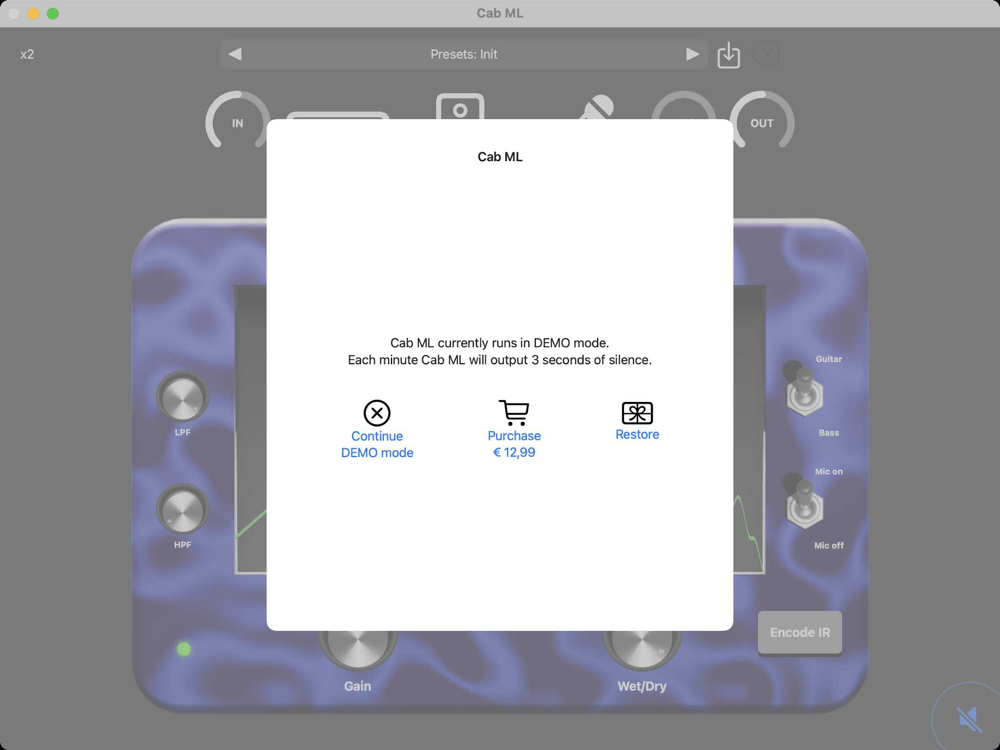
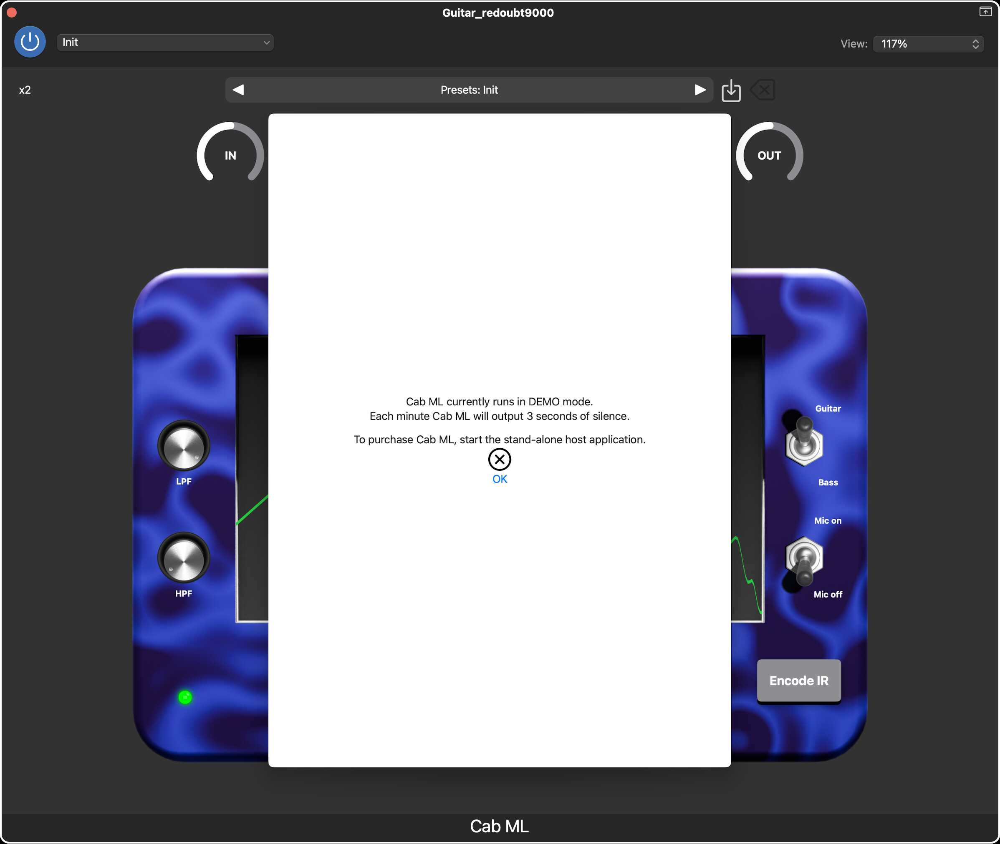

# jAmp Cab ML (AUv3) manual

Welcome to the [jAmp Cab ML](https://www.jamp-audio.com) manual!

## System requirements

Cab ML is an AUv3 (Audio Unit version 3) plugin that can be used as a stand-alone application on iOS and macOS, or as an audio plugin inside a host application on iOS and macOS. 

Minimal requirements are:
  - iOS 14.0 or later for mobile (iPhone or iPad)
  - macOS 11.0 or later for desktop / laptop

The Cab ML software is distributed via the Apple App store. Click on the App store badge to go to the download location.

## Purchase info

Installation of Cab ML is free, but it will run in DEMO mode. This means that every minute Cab ML will output 3 seconds of silence. This allows the user to test the audio plugin in depth before purchasing it.

Purchasing Cab ML is a straightforward and user-friendly process, following the standard steps from the Apple App Store you're likely familiar with. Once the plugin is unlocked, the DEMO mode will be gone, and you can enjoy the full potential.

To start the payment process you have to run Cab ML in stand-alone mode. A popup as in the image above should appear. Simply tap or click on "Purchase" and the Apple App Store will guide you through the process.

Note that you should only pay once to unlock the plugin. In case you have a new device, you can get the plugin unlocked by clicking on "Restore". If you go a second time through the payment system, no worries, Apple will notice this and give you the plugin for free.

Note that it is not possible to purchase the audio plugin via a third-party host application. If you run Cab ML via for instance GarageBand you will get a message as in the image above. Just start the stand-alone Cab ML application if you want to purchase.

## Navigation bar

The navigation bar at the top of your view consists of two rows. The top row controls the oversampling rate and the preset section. The second row represents the signal chain flow. We can navigate via icons to the different sections (poweramp, cabinet, microphone), and we can control the input and output level and the doubler effect.

### Top row

At the top left you can control the amount of oversampling. Generally, the more oversampling that is used, the better the simulation will be. The default oversampling rate is x2 as this gives good sound quality and is still easy on the CPU. If you go to a lower oversampling rate (x1), the plugin will be less demanding for your CPU but the sound quality is less. 

In the middle we have the preset section. There are a bunch of factory settings that you can experiment with. Furthermore, you can also save your own user settings. The icon with the arrow pointing downward will allow you to save your preset. A popup will show up asking you for the name of your user preset. If the suggested name is colored red, it means that you will overwrite an already existing user preset. You can also delete a user preset by tapping or clicking on the icon with the X mark. Note that you cannot delete factory settings.

### Signal chain row

 Control the signal input

 Go to the poweramp section

 Go to the cabinet section

 Go to the microphone section

 Add stereo effect by delaying the right channel wrt the left channel (disabled when poweramp is in stereo mode)

 Control the signal output

### Mute button
If you run Cab ML in it's stand-alone format, you will have an icon of a speaker on the bottom right. This is your muting button. By default, at startup, the sound will be muted to avoid any unwanted feedback. Don't forget to unmute before you start playing.
